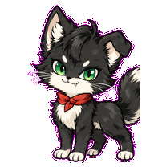
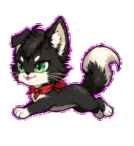
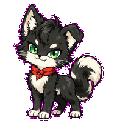
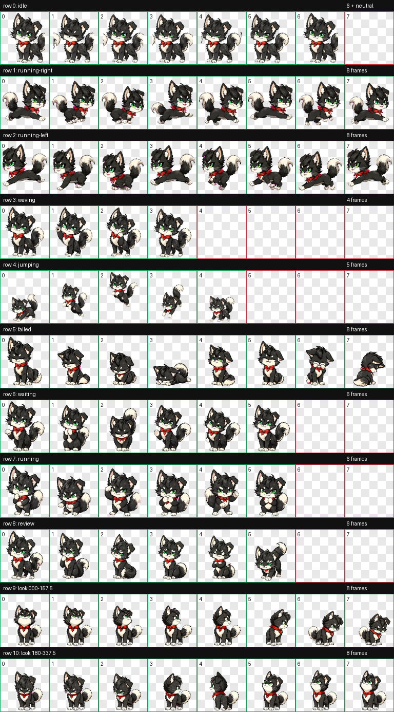

<div align="center">

# Badmo / 坏墨

**A mischievous animated fox-cat for Codex Desktop.**

一只神情可疑、做事精确的炭黑色狐猫。


</div>

坏墨拥有一只折耳、翠绿色眼睛和朱红色围巾。本仓库提供可直接安装的 Codex v2 宠物包、完整的 `8 × 11` 动画精灵图，以及可审查的生成、装配和质量检查记录。

<div align="center">
  
  
  
</div>

## 快速安装

下载或克隆仓库后，在 PowerShell 中运行：

```powershell
$target = Join-Path $env:USERPROFILE ".codex\pets\huaimo"
New-Item -ItemType Directory -Force -Path $target | Out-Null
Copy-Item -Force ".\package\huaimo\pet.json", ".\package\huaimo\spritesheet.webp" -Destination $target
```

完全退出并重新打开 Codex Desktop，然后在宠物或外观入口中选择“坏墨”。它是 Codex 的视觉素材包，不是独立可执行程序，因此不需要安装依赖或启动服务器。

只需要成品文件时，可直接使用 [`package/huaimo`](package/huaimo)：

```text
package/huaimo/
├── pet.json
└── spritesheet.webp
```

## 动画预览



| 行 | 状态 | 帧数 | 用途 |
| ---: | --- | ---: | --- |
| 0 | `idle` | 6 | 待机、呼吸和眨眼 |
| 1 | `running-right` | 8 | 向右移动 |
| 2 | `running-left` | 8 | 向左移动 |
| 3 | `waving` | 4 | 挥手或吸引注意 |
| 4 | `jumping` | 5 | 跳跃 |
| 5 | `failed` | 8 | 失败或取消反馈 |
| 6 | `waiting` | 6 | 等待输入或授权 |
| 7 | `running` | 6 | 任务处理中 |
| 8 | `review` | 6 | 等待检查或任务完成 |
| 9 | `look 000–157.5` | 8 | 上方至右下方观察 |
| 10 | `look 180–337.5` | 8 | 下方至左上方观察 |

## 精灵图规格

| 属性 | 值 |
| --- | --- |
| Codex 格式 | v2，`spriteVersionNumber: 2` |
| 文件格式 | RGBA WebP |
| 图集尺寸 | `1536 × 2288` |
| 网格 | 8 列 × 11 行 |
| 单格尺寸 | `192 × 208` |
| 标准状态 | 9 组 |
| 观察方向 | 16 个，顺时针排列 |

最终素材已执行透明背景处理和边缘去色，并通过图集结构校验、三名独立审查者的方向盲测以及最终视觉 QA。

## 在网页中使用

`spritesheet.webp` 是普通透明 WebP，可以通过 CSS、Canvas 或游戏引擎播放。纯前端播放不需要 OpenAI API。

下面的最小示例播放第 0 行的 6 帧待机动画：

```html
<div id="badmo" role="img" aria-label="坏墨动画宠物"></div>

<style>
  #badmo {
    width: 192px;
    height: 208px;
    background: url("./package/huaimo/spritesheet.webp") no-repeat;
    background-size: 1536px 2288px;
  }
</style>

<script>
  const badmo = document.querySelector("#badmo");
  const cellWidth = 192;
  const cellHeight = 208;
  const row = 0;
  const frameCount = 6;
  let frame = 0;

  setInterval(() => {
    const x = -(frame * cellWidth);
    const y = -(row * cellHeight);
    badmo.style.backgroundPosition = `${x}px ${y}px`;
    frame = (frame + 1) % frameCount;
  }, 140);
</script>
```

切换 `row` 和 `frameCount` 即可播放上表中的其他状态。生产网站可进一步使用 `requestAnimationFrame`、状态机和响应式缩放。

## 项目结构

```text
huaimo-repair-run/
├── package/huaimo/          # 推荐安装和发布的最小宠物包
├── final/                   # 最终图集及确定性验证结果
├── qa/                      # 联系表、GIF、方向盲测与视觉 QA
├── frames/                  # 标准动画逐帧素材
├── decoded/                 # 解码后的生成行素材
├── selected/                # 被选中的生成结果
├── references/              # 角色基准图与布局参考
├── prompts/                 # 各动画行的生成提示词
├── pet_request.json         # 宠物规格与动画契约
└── imagegen-jobs.json       # 图像生成任务记录
```

安装或嵌入网页时只需 `package/huaimo/`。其他目录用于复现、审查和后续修复。

## 质量检查

- [最终图集验证](final/validation-extended.json)
- [QA 汇总](qa/run-summary.json)
- [方向语义检查](qa/direction-semantics.json)
- [三人方向盲测](qa/direction-blind-validation.json)
- [动画 GIF 预览](qa/previews/)

确定性验证结果为 `ok: true`。部分中间角度保留了已审查的轻微可读性警告；四个基准方向、完整顺时针观察循环和最终视觉 QA 均已通过。

## 版本说明

当前版本是第一次孵化结果的修复版：

- 使用原生左向动画替换镜像 `running-left`，消除色边问题
- 重绘后半圈观察方向，使 `180°` 朝下姿势通过盲测
- 重新完成装配、透明边缘处理、Codex v2 校验和视觉 QA

## 制作说明

角色视觉与动画素材由 OpenAI Codex、ImageGen 和 `hatch-pet` 工作流辅助生成，并通过确定性图像处理脚本装配和验证。仓库保留了提示词与 QA 产物，便于了解生成过程和继续改进。

## License

本项目采用 [MIT License](LICENSE)。你可以使用、复制、修改、合并、发布和分发本项目，但须保留原版权声明和许可证文本。

Copyright © 2026 [bshr000](https://github.com/bshr000)
